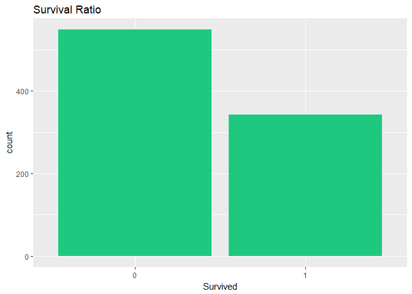
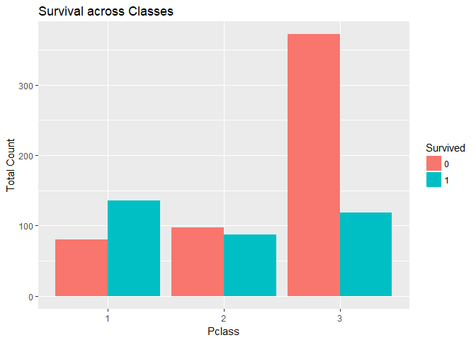
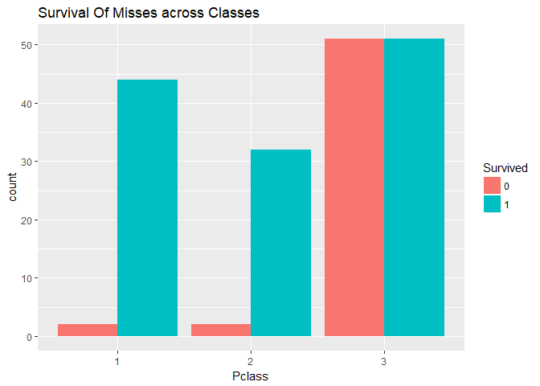
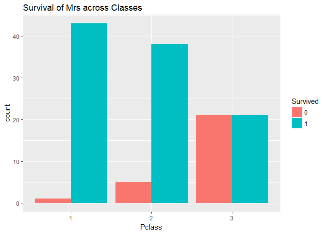
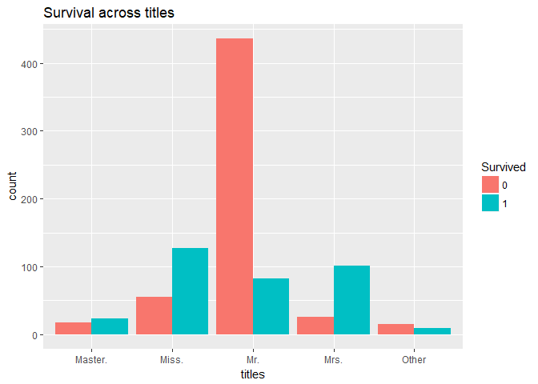
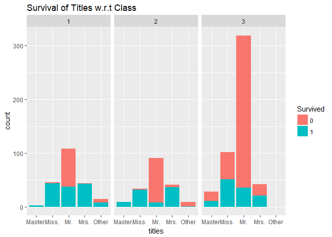

    knitr::opts_chunk$set(echo = TRUE)

Our Project is about Determining whether a person is dead or was lucky
enough to survive from the titanic trajedgy

    train <- read.csv('train.csv')
    test  <- read.csv('test.csv')

Looking at our data
-------------------

    str(train)

    ## 'data.frame':    891 obs. of  12 variables:
    ##  $ PassengerId: int  1 2 3 4 5 6 7 8 9 10 ...
    ##  $ Survived   : int  0 1 1 1 0 0 0 0 1 1 ...
    ##  $ Pclass     : int  3 1 3 1 3 3 1 3 3 2 ...
    ##  $ Name       : Factor w/ 891 levels "Abbing, Mr. Anthony",..: 109 191 358 277 16 559 520 629 417 581 ...
    ##  $ Sex        : Factor w/ 2 levels "female","male": 2 1 1 1 2 2 2 2 1 1 ...
    ##  $ Age        : num  22 38 26 35 35 NA 54 2 27 14 ...
    ##  $ SibSp      : int  1 1 0 1 0 0 0 3 0 1 ...
    ##  $ Parch      : int  0 0 0 0 0 0 0 1 2 0 ...
    ##  $ Ticket     : Factor w/ 681 levels "110152","110413",..: 524 597 670 50 473 276 86 396 345 133 ...
    ##  $ Fare       : num  7.25 71.28 7.92 53.1 8.05 ...
    ##  $ Cabin      : Factor w/ 148 levels "","A10","A14",..: 1 83 1 57 1 1 131 1 1 1 ...
    ##  $ Embarked   : Factor w/ 4 levels "","C","Q","S": 4 2 4 4 4 3 4 4 4 2 ...

    str(test)

    ## 'data.frame':    418 obs. of  11 variables:
    ##  $ PassengerId: int  892 893 894 895 896 897 898 899 900 901 ...
    ##  $ Pclass     : int  3 3 2 3 3 3 3 2 3 3 ...
    ##  $ Name       : Factor w/ 418 levels "Abbott, Master. Eugene Joseph",..: 210 409 273 414 182 370 85 58 5 104 ...
    ##  $ Sex        : Factor w/ 2 levels "female","male": 2 1 2 2 1 2 1 2 1 2 ...
    ##  $ Age        : num  34.5 47 62 27 22 14 30 26 18 21 ...
    ##  $ SibSp      : int  0 1 0 0 1 0 0 1 0 2 ...
    ##  $ Parch      : int  0 0 0 0 1 0 0 1 0 0 ...
    ##  $ Ticket     : Factor w/ 363 levels "110469","110489",..: 153 222 74 148 139 262 159 85 101 270 ...
    ##  $ Fare       : num  7.83 7 9.69 8.66 12.29 ...
    ##  $ Cabin      : Factor w/ 77 levels "","A11","A18",..: 1 1 1 1 1 1 1 1 1 1 ...
    ##  $ Embarked   : Factor w/ 3 levels "C","Q","S": 2 3 2 3 3 3 2 3 1 3 ...

First thing to notice, Some Features has variables with type **numeric**
or **int** that can be turned to **factor** as it's a **Discrete**
Feature. (Survived, Pclass, Sibsb, Parch)

But before that, We combine both train and test in a single DataFrame

Test dataset contains all train dataset Features except the *Survived*
feature since it's the Dependent Variable in Our Challenge (that we
should predict its value)

So we add the Survived Column, thus we can combine 2 datasets by row

    test.survived <- data.frame(Survived = rep("None" , nrow(test)), test[,])

    dim(train)

    ## [1] 891  12

    dim(test.survived)

    ## [1] 418  12

    data.combined <- rbind(train , test.survived)

Making sure that these features can be treated as cateorical data

      table(data.combined$SibSp)

    ## 
    ##   0   1   2   3   4   5   8 
    ## 891 319  42  20  22   6   9

      table(data.combined$Parch)

    ## 
    ##    0    1    2    3    4    5    6    9 
    ## 1002  170  113    8    6    6    2    2

So we can convert data-type of those features to be Categorical

    data.combined$Survived <- as.factor(data.combined$Survived)
    data.combined$Pclass <- as.factor(data.combined$Pclass)
    data.combined$SibSp <- as.factor(data.combined$SibSp)
    data.combined$Parch <- as.factor(data.combined$Parch)

### Plotting is the Best way to analyse your data

Well the data is Skewed to people didn't make it.

    ggplot(data.combined[which(data.combined$Survived != "None"),],aes(x= Survived))+
           geom_bar(fill = "#1ec97f")+
           ggtitle("Survival Ratio")

The Same previous plot, according to classes

    ggplot(data.combined[data.combined$Survived != "None",], aes(x = Pclass, fill = Survived))+
      geom_bar( position = "dodge")+
      xlab("Pclass")+
      ylab("Total Count")+
      labs(fill = "Survived")+
      ggtitle("Survival across Classes")

First class has the Highest probability for Survivnig While the third
class is absolute opposite Second class fifty-fifty

which means *Class* is an important Feature, that we should take into
consideration while building our model

Moving to *Names* Feature

    head(data.combined$Name)

    ## [1] Braund, Mr. Owen Harris                            
    ## [2] Cumings, Mrs. John Bradley (Florence Briggs Thayer)
    ## [3] Heikkinen, Miss. Laina                             
    ## [4] Futrelle, Mrs. Jacques Heath (Lily May Peel)       
    ## [5] Allen, Mr. William Henry                           
    ## [6] Moran, Mr. James                                   
    ## 1307 Levels: Abbing, Mr. Anthony ... Zakarian, Mr. Ortin

`"Mr", "Mrs", "Miss", "Master"` these names may help us in our analysis,
or we can create a new Feature depends on these `titles`

let's see if that hypothese is true

We extract "Misses" only from all the passengers

► `str_detect()` takes : 1- vector of string (Name column) -- 2- pattern
(the "Miss" string) Outputs: Logical vector (Miss or Not)

    misses <- data.combined[which(str_detect(data.combined$Name , "Miss.")) , ]
    nrow(misses)

    ## [1] 260

Now plotting `misses` to see if it's an effective feature or not

    ggplot(misses[misses$Survived != "None" ,] ,
           aes(x = Pclass , fill = Survived))+
           geom_bar(position = "dodge")+
           ggtitle("Survival Of Misses across Classes")

Well it seems that in Class 1, class 2 : we can say All misses Survived
class 3 : it looks like a coin luck.

So doing same through another `title`

    Mrs <- data.combined[which(str_detect(data.combined$Name , "Mrs.")) ,]
    nrow(Mrs)

    ## [1] 201

    ggplot(Mrs[Mrs$Survived != "None" , ] ,aes(x = Pclass , fill = Survived))+
      geom_bar(position = "dodge")+
      ggtitle("Survival of Mrs across Classes")

Looks the same as the `Miss` title

So it may be a good feature to create

first thing we make a method that returns whatever title it is then add
it into a vector that we then insert to our `data.combined` dataFrame

►`grep()` method takes : pattern first string value (Name) outputs: 1
(match) integer(0) (didn't match)

we convert the `integer(0) -> 0` using `length()`;

    assign_titles <- function(name){
      
      name <- as.character(name)
      
      if(length(grep("Miss." , name) > 0))
        return("Miss.")
      if(length(grep("Mrs."  , name) > 0))
        return("Mrs.")
      if(length(grep("Mr." , name) > 0))
        return("Mr.")
      if(length(grep("Master" , name) > 0))
        return("Master.")
      else
        return("Other")
    }

Now initalizing the `title` vector

    titles <- NULL

and inserting new titles using our methods

    for(i in 1:nrow(data.combined)){
      titles <- c(titles , assign_titles(data.combined[i , "Name"]))
    }

finally, adding it to our dataframe

    data.combined$titles <- as.factor(titles)

Here is our new Feature, with corresponding names, token randomly

    sample_n(data.combined[, c("Name", "titles")], 5)

    ##                              Name  titles
    ## 1015      Carver, Mr. Alfred John     Mr.
    ## 112          Zabour, Miss. Hileni   Miss.
    ## 165  Panula, Master. Eino Viljami Master.
    ## 1195            Pokrnic, Mr. Tome     Mr.
    ## 1096     Andrew, Mr. Frank Thomas     Mr.

See what this feature say

    ggplot(data.combined[which(data.combined$Survived != "None"),],aes(x = titles, fill=Survived))+
      geom_bar(position = "dodge")+
      ggtitle("Survival across titles")

which means that `Men` are the most likely to be dead and `Miss, Mrs`
more likely to live while masters (young men) have equal propability
(until now)

Now look at our data with respect to `Class, title and Survived`
Features

    ggplot(data.combined[data.combined$Survived != "None", ] , aes(x = titles , fill = Survived))+
      geom_bar()+
      facet_wrap(~Pclass)+
      ggtitle("Survival of Titles w.r.t Class")

we can see that *Master*: survived with 100% in class 1 and 2  
*Misses*: almost same  *Mrs* : almost same   *Mr* : in class 1 -
50/50  in class 2 - more probable to be dead   in class 3 the
Savage class.  *Mr* are the most likely to die  while others have
almost 50/50 probability  

Note that the `echo = FALSE` parameter was added to the code chunk to
prevent printing of the R code that generated the plot.
